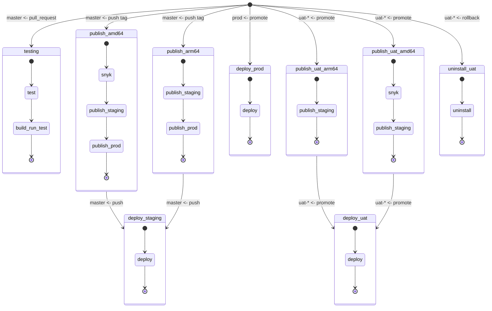

```mermaid
stateDiagram-v2
	[*] --> testing : master <- pull_request
	state testing {
		testingtest : test
		testingbuild_run_test : build_run_test
		[*] --> testingtest
		testingtest --> testingbuild_run_test
		testingbuild_run_test --> [*]
	}

	[*] --> publish_amd64 : master <- push tag
	state publish_amd64 {
		publish_amd64snyk : snyk
		publish_amd64publish_staging : publish_staging
		publish_amd64publish_prod : publish_prod
		[*] --> publish_amd64snyk
		publish_amd64snyk --> publish_amd64publish_staging
		publish_amd64publish_staging --> publish_amd64publish_prod
		publish_amd64publish_prod --> [*]
	}

	[*] --> publish_arm64 : master <- push tag
	state publish_arm64 {
		publish_arm64publish_staging : publish_staging
		publish_arm64publish_prod : publish_prod
		[*] --> publish_arm64publish_staging
		publish_arm64publish_staging --> publish_arm64publish_prod
		publish_arm64publish_prod --> [*]
	}

	publish_amd64 --> deploy_staging : master <- push
	publish_arm64 --> deploy_staging : master <- push
	state deploy_staging {
		deploy_stagingdeploy : deploy
		[*] --> deploy_stagingdeploy
		deploy_stagingdeploy --> [*]
	}

	[*] --> deploy_prod : prod <- promote
	state deploy_prod {
		deploy_proddeploy : deploy
		[*] --> deploy_proddeploy
		deploy_proddeploy --> [*]
	}

	[*] --> publish_uat_amd64 : uat-* <- promote
	state publish_uat_amd64 {
		publish_uat_amd64snyk : snyk
		publish_uat_amd64publish_staging : publish_staging
		[*] --> publish_uat_amd64snyk
		publish_uat_amd64snyk --> publish_uat_amd64publish_staging
		publish_uat_amd64publish_staging --> [*]
	}

	[*] --> publish_uat_arm64 : uat-* <- promote
	state publish_uat_arm64 {
		publish_uat_arm64publish_staging : publish_staging
		[*] --> publish_uat_arm64publish_staging
		publish_uat_arm64publish_staging --> [*]
	}

	publish_uat_arm64 --> deploy_uat : uat-* <- promote
	publish_uat_amd64 --> deploy_uat : uat-* <- promote
	state deploy_uat {
		deploy_uatdeploy : deploy
		[*] --> deploy_uatdeploy
		deploy_uatdeploy --> [*]
	}

	[*] --> uninstall_uat : uat-* <- rollback
	state uninstall_uat {
		uninstall_uatuninstall : uninstall
		[*] --> uninstall_uatuninstall
		uninstall_uatuninstall --> [*]
	}

```
